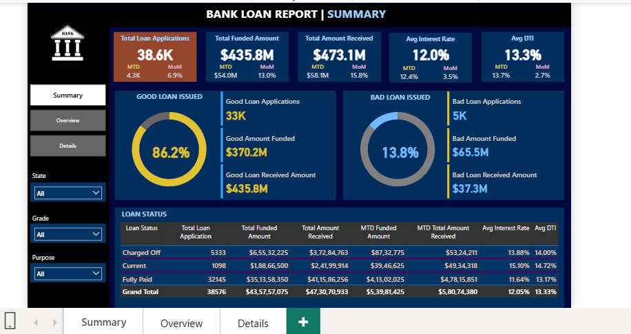
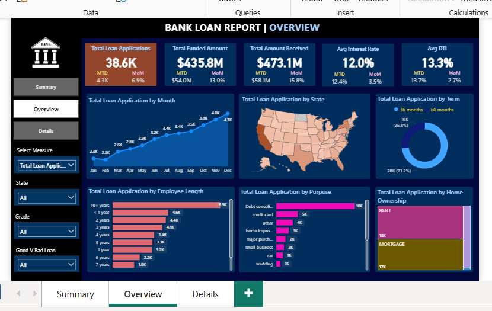
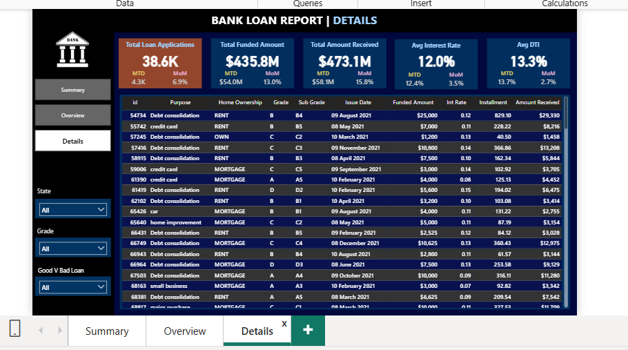
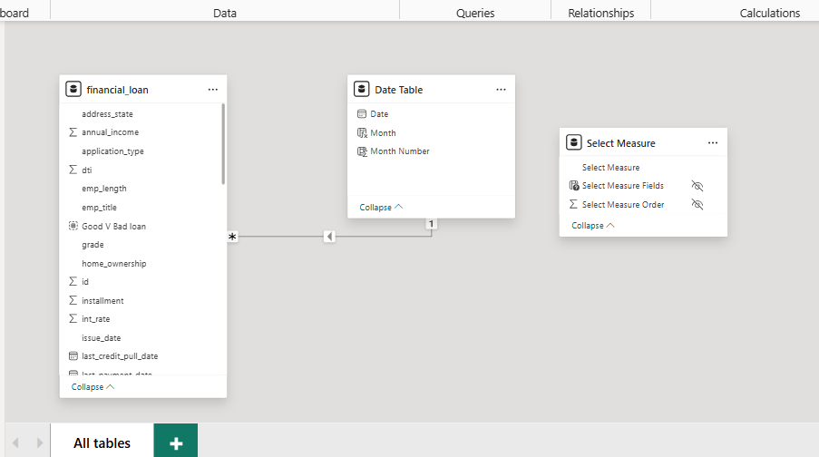

# 📊 Bank Loan Report | Power BI Dashboard


---

# 📌 Project Overview

The **Bank Loan Report** is an interactive Business Intelligence dashboard developed using **Microsoft Power BI** to analyze and visualize bank loan data. The project provides a comprehensive overview of loan applications, funding, repayments, borrower profiles, and loan performance through dynamic visualizations and Key Performance Indicators (KPIs).

The dashboard enables financial institutions and business users to monitor lending performance, identify high-risk loans, analyze customer behavior, and support data-driven decision-making.

---

# 🎯 Project Objectives

- Analyze total loan applications received.
- Monitor funded loan amounts and repayments.
- Track Month-to-Date (MTD) and Month-over-Month (MoM) performance.
- Evaluate Good Loans and Bad Loans.
- Analyze regional lending performance.
- Study customer demographics and borrowing behavior.
- Provide detailed loan-level insights through an interactive dashboard.

---

# 🛠 Tech Stack

| Tool | Purpose |
|------|----------|
| Microsoft Power BI | Dashboard Development |
| Microsoft SQL Server | Data Storage & Querying |
| SQL | Business Analysis |
| Power Query | Data Cleaning & Transformation |
| DAX | KPI & Measure Creation |
| CSV Dataset | Source Data |

---

# 📂 Dataset

The project uses a financial loan dataset containing customer and loan-related information.

### Dataset Fields

- Loan ID
- Address State
- Employment Length
- Employment Title
- Grade
- Sub Grade
- Home Ownership
- Issue Date
- Loan Status
- Loan Purpose
- Loan Term
- Annual Income
- Debt-to-Income Ratio (DTI)
- Interest Rate
- Installment
- Loan Amount
- Total Payment

The dataset is used to evaluate lending performance, repayment trends, borrower characteristics, and loan portfolio health.

---

# 📈 Dashboard Features

## Dashboard 1 – Summary

The Summary Dashboard provides an executive overview of the loan portfolio through Key Performance Indicators (KPIs) and loan performance metrics.

### Key Performance Indicators

- Total Loan Applications
- Total Funded Amount
- Total Amount Received
- Average Interest Rate
- Average Debt-to-Income Ratio (DTI)
- Month-to-Date (MTD) Metrics
- Month-over-Month (MoM) Analysis

### Loan Performance

- Good Loan Percentage
- Good Loan Applications
- Good Loan Funded Amount
- Good Loan Amount Received

- Bad Loan Percentage
- Bad Loan Applications
- Bad Loan Funded Amount
- Bad Loan Amount Received

### Loan Status Grid

Displays:

- Loan Status
- Loan Applications
- Funded Amount
- Amount Received
- MTD Funded Amount
- MTD Amount Received
- Average Interest Rate
- Average DTI

---

## Dashboard 2 – Overview

The Overview Dashboard provides visual insights into lending patterns through interactive charts.

### Visualizations

- Monthly Loan Application Trend
- State-wise Loan Distribution (Map)
- Loan Term Analysis
- Employee Length Analysis
- Loan Purpose Breakdown
- Home Ownership Distribution

Interactive slicers allow filtering by:

- State
- Grade
- Good vs Bad Loan
- Selected Measure

---

## Dashboard 3 – Details

The Details Dashboard provides a detailed record-level view of the complete loan dataset.

Displayed information includes:

- Loan ID
- Loan Purpose
- Home Ownership
- Grade
- Sub Grade
- Issue Date
- Funded Amount
- Interest Rate
- Installment
- Amount Received

Interactive filters make it easy to explore individual loan records.

---

# 📷 Dashboard Preview

## 📌 Summary Dashboard



### Highlights

- Executive KPI Cards
- Good vs Bad Loan Analysis
- Loan Status Overview
- Interactive Filters

---

## 📌 Overview Dashboard



### Highlights

- Monthly Loan Trends
- State-wise Analysis
- Loan Term Distribution
- Employment Length Analysis
- Loan Purpose Analysis
- Home Ownership Distribution

---

## 📌 Details Dashboard



### Highlights

- Complete Loan Records
- Loan-Level Details
- Interactive Data Exploration
- Dynamic Filtering

---

## 📌 Data Model



### Data Model Overview

The dashboard follows a clean data model consisting of:

- Financial Loan Fact Table
- Date Dimension Table
- Disconnected Measure Table for Dynamic Measure Selection

This model enables efficient filtering, accurate calculations, and improved dashboard performance.

---

# 📊 Key Performance Indicators (KPIs)

- Total Loan Applications
- Month-to-Date Loan Applications
- Month-over-Month Loan Applications

- Total Funded Amount
- Month-to-Date Funded Amount

- Total Amount Received
- Month-to-Date Amount Received

- Average Interest Rate

- Average Debt-to-Income Ratio (DTI)

- Good Loan Percentage

- Bad Loan Percentage

---

# 📈 SQL Analysis

SQL was used to validate business metrics before building the dashboard.

The following analyses were performed:

- Total Loan Applications
- Total Funded Amount
- Total Amount Received
- Average Interest Rate
- Average DTI
- Good Loan Analysis
- Bad Loan Analysis
- Loan Status Summary
- Monthly Trends
- Regional Analysis
- Loan Term Analysis
- Employment Length Analysis
- Loan Purpose Analysis
- Home Ownership Analysis

---

# 📊 Business Insights

The dashboard helps answer important business questions such as:

- How many loan applications have been received?
- How much money has been funded?
- How much money has been recovered?
- What percentage of loans are Good Loans?
- What percentage are Bad Loans?
- Which states have the highest loan applications?
- Which loan purposes are most common?
- Which employment groups receive the highest number of loans?
- What is the average Interest Rate?
- What is the average Debt-to-Income Ratio?

---

# 🧹 Data Preparation

Data preprocessing included:

- Data Cleaning
- Removing unnecessary columns
- Handling missing values
- Data Type Conversion
- Creating Date Table
- Power Query Transformations
- Data Modeling
- Relationship Creation
- DAX Measure Creation

---

# ⭐ DAX Measures Created

Examples of measures used:

- Total Loan Applications
- MTD Loan Applications
- PMTD Loan Applications
- Total Funded Amount
- Total Amount Received
- Average Interest Rate
- Average DTI
- Good Loan Percentage
- Bad Loan Percentage
- Good Loan Funded Amount
- Bad Loan Funded Amount
- Good Loan Amount Received
- Bad Loan Amount Received

---

# 📁 Project Structure

```
Bank-Loan-Report/
│
├── Bank Loan Report.pbix
├── financial_loan.csv
├── SQL Queries.sql
├── README.md
│
├── Images/
│   ├── summary-dashboard.png
│   ├── overview-dashboard.png
│   ├── details-dashboard.png
│   └── data-model.png
│
└── Documentation/
    ├── Domain Knowledge.docx
    ├── Terminologies.docx
    └── Query Document.docx
```

---

# 🚀 How to Use

1. Clone this repository.

```
git clone https://github.com/yourusername/Bank-Loan-Report.git
```

2. Open the **Power BI (.pbix)** file using Microsoft Power BI Desktop.

3. Refresh the dataset if necessary.

4. Explore the interactive dashboards using the slicers and filters.

---

# 💼 Skills Demonstrated

- Business Intelligence
- Power BI Dashboard Development
- Data Visualization
- SQL Query Writing
- Power Query
- DAX
- Data Cleaning
- Data Modeling
- Financial Data Analysis
- KPI Development
- Interactive Reporting

---

# 📌 Future Enhancements

- Real-time SQL Server Integration
- Power BI Service Deployment
- Scheduled Data Refresh
- Row-Level Security (RLS)
- Predictive Loan Default Analysis

---

# 🤝 Contributing

Contributions are welcome!

Feel free to fork this repository, raise issues, or submit pull requests for improvements.

---

# 📄 License

This project is intended for educational and portfolio purposes.

---

# 👩‍💻 Author

## Aryan Awar

**Power BI • SQL • DAX • Power Query • Data Analytics**

If you found this project useful, consider giving it a ⭐ on GitHub!
